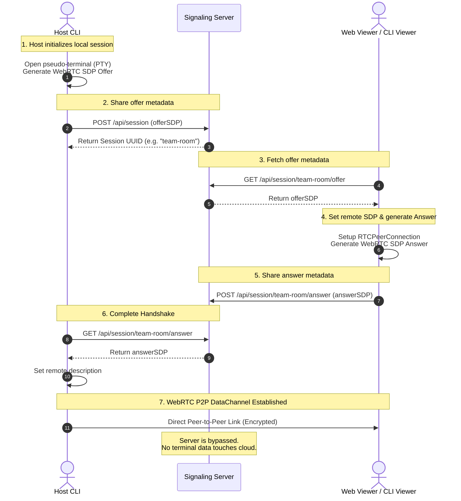

# MiniShare Repository Architecture & Design 🗺️

This document describes the codebase architecture, folder structure, and signaling flow of **MiniShare**.

---

## 📂 Repository Architecture

MiniShare is organized into two completely decoupled Go modules:

```text
MiniShare/
├── cli/                        # 💻 Terminal CLI Application (Host & Viewer)
│   ├── main.go                 # Unified CLI Binary (Host, Viewer, Daemon, Config)
│   ├── config.json             # Local configuration file (persisted per user)
│   ├── go.mod                  # Independent CLI Go module dependencies
│   └── README.md               # CLI-specific documentation
│
├── server/                     # 🌐 Cloud Signaling Server & Web SPA
│   ├── main.go                 # Pure Go HTTP Signaling Server (embeds HTML files)
│   ├── index.html              # Embedded Web Landing Page (minishare.dev landing)
│   ├── app.html                # Embedded Web Terminal client SPA (xterm.js / WebRTC)
│   ├── go.mod                  # Independent Server Go module dependencies
│   ├── Dockerfile              # Production container build definition
│   └── README.md               # Server deployment documentation
```

---

## 🔗 Signaling & P2P Stream Architecture

MiniShare operates on a hybrid architecture. The signaling server is only used to establish connection metadata, while the terminal data streams **100% peer-to-peer (P2P)** with End-to-End Encryption.



### Key Architectural Advantages
1. **Stateless Web Handshake**: The signaling endpoints are simple REST endpoints (`GET/POST`). This allows the server to scale effortlessly.
2. **Embedded Assets**: The Go server uses Go's native `//go:embed` feature, packing the entire server code, landing page (`index.html`), and terminal client (`app.html`) into a single executable binary.
3. **Low Latency & High Security**: WebRTC DataChannels transfer raw keystroke and terminal stream bytes directly between the host and viewer machines, eliminating middleman latency and keeping shell operations secure.
